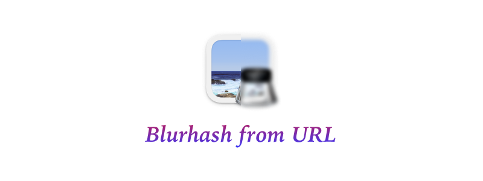

# Generate Blurhash from Image URL

:unicorn: Simple utility to generate blurhash from Image URL




### :package: Requirements

- Node.js 16X LTS or Higher 📦

### :sparkles: Installation

- Install the NPM Package with the below command:

```
npm install blurhash-from-url --save
```

(or)

- Install with Yarn:

```
yarn add blurhash-from-url
```

### :bulb: Usage Example

- Import it in your project
- Pass the URL of the image
- Make sure to use Async/Await function

```javascript
//ES6 Import
import { blurhashFromURL } from "blurhash-from-url";

// Commonjs Import
// const { blurhashFromURL } = require("blurhash-from-url");

async function getBlurhash() {
  const output = await blurhashFromURL("https://i.imgur.com/NhfEdg2.png");
  console.log(output);
}

getBlurhash();
```

### :ballot_box_with_check: Example Output

```json
{
  encoded: 'UnR.*,kW.TnPt7WBocozpJV@nMkWadofWCV@',
  decoded: Uint8ClampedArray(1440000) [
    255, 255, 251, 255, 255, 255, 251, 255, 255, 255, 251, 255,
    255, 255, 251, 255, 255, 255, 251, 255, 255, 255, 251, 255,
    255, 255, 251, 255, 255, 255, 251, 255, 255, 255, 251, 255,
    255, 255, 251, 255, 255, 255, 250, 255, 255, 255, 250, 255,
    255, 255, 250, 255, 255, 255, 250, 255, 255, 255, 250, 255,
    255, 255, 250, 255, 255, 255, 250, 255, 255, 255, 250, 255,
    255, 255, 250, 255, 255, 255, 250, 255, 255, 255, 250, 255,
    255, 255, 250, 255, 255, 255, 250, 255, 255, 255, 250, 255,
    255, 255, 250, 255,
    ... 1439900 more items
  ],
  width: 600,
  height: 600
}
```

### Optional Size Parameter

By default, the image is resized to 32x32. You can pass the size as an optional parameter.

```javascript
async function getBlurhash() {
  const output = await blurhashFromURL("https://i.imgur.com/NhfEdg2.png", {
    size: 64,
  });
  console.log(output);
}
```

---

#### :green_heart: Message

I hope you find this useful. If you have any questions, please create an issue.
